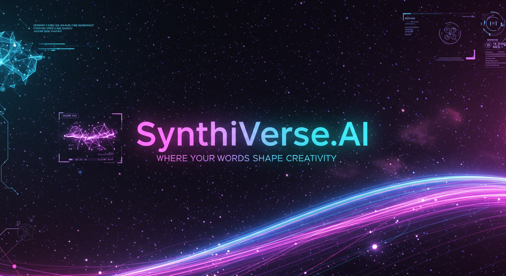

# 🧠 SynthiVerse.AI

**A Multimodal Generative AI System — Bringing together text-to-image, text-to-audio, and text-to-video generation in one powerful interface.**

[](https://gradio.app/)
[](https://www.python.org/downloads/)
[](https://opensource.org/licenses/MIT)



## 🚀 Overview

**SynthiVerse.AI** is a creative synthesis platform powered by state-of-the-art generative models. It provides a unified interface for users to generate:

-   🎨 **Images** from text prompts using Stable Diffusion (from Scratch)
-   🔊 **Audio** from text prompts using Bark (Suno AI).
-   🎥 **Video** from text prompts (coming soon!).

Stable Diffusion is a latent diffusion model that generates images from text prompts. This implementation breaks down the model into its core components:

1.  **CLIP Text Encoder**: Converts the input text prompt into a numerical representation (embedding).
2.  **Variational Autoencoder (VAE)**: Encodes images into a compressed latent space and decodes latents back into images.
3.  **U-Net Denoising Model**: The core of the diffusion process, which iteratively removes noise from a latent representation, guided by the text embedding.
4.  **Scheduler**: Manages the noise schedule and timesteps during the denoising process.

This code is heavily commented to explain each step, making it an ideal resource for learning and experimentation.

This project aims to democratize access to multimodal AI tools by combining them into a single, easy-to-use application.

## 🛠️ Key Features

-   ✔️ **Intuitive Interface**: A clean, multi-tab Gradio UI for seamless navigation between generation modes.
-   ✔️ **Text-to-Image**: Generate high-quality images with configurable parameters like CFG scale, samplers, steps, and seed.
-   ✔️ **Text-to-Audio**: Create realistic speech, music, and sound effects from text using pre-trained Bark models.
-   🚧 **Text-to-Video**: A placeholder tab is included, ready for future integration of a video synthesis model.
-   🖥️ **Smart Device Selection**: Automatically detects and utilizes the best available device (`CUDA`, `MPS`, or `CPU`).
-   📦 **Modular Codebase**: The project is structured with clear separation of concerns (models, pipelines, UI), making it easy to extend and maintain.

---

## 📸 Sample Output

| Text Prompt                               | Generated Image                          |
| :---------------------------------------- | :--------------------------------------- |
| `a cyberpunk astronaut walking on Mars`   |  |
| `a monkey playing with a balloon`         |        |

---

## 📁 Project Structure

```text
SynthiVerse.AI/
├──Documentation
├──References
├── assets/
│   └── sample_image.png
│  └── output.png
├── Text-2-Image/
│   ├── stable_diffusion/
│   │   ├── model_loader.py
│   │   └── Setup1.py
│   │   └── pipeline.py
│   └── data/
│       ├── vocab.json
│       └── model.ckpt 
│       └── merges.txt
├── Text-2-Audio/
│   └── bark/
│       └──audioapp.py
│       └── ...
│
├── requirements.txt    # Project dependencies
└── README.md
```

---

## ⚙️ Setup and Installation

Follow these steps to get SynthiVerse.AI running on your local machine.

### 1. Clone the Repository

```bash
git clone https://github.com/yourusername/SynthiVerse.AI.git
cd SynthiVerse.AI
```

### 2. Create and Activate a Virtual Environment

It is highly recommended to use a virtual environment to manage dependencies.

**Using `conda`:**
```bash
conda create -n synthiverse python=3.10
conda activate synthiverse
```
**Or using `venv`:**
```bash
python3 -m venv venv
source venv/bin/activate  # On Windows, use: venv\Scripts\activate
```

### 3. Install Dependencies

Install all the required Python packages using pip.
```bash
pip install -r requirements.txt
```

### 4. Download Model Weights

-   **Stable Diffusion**: Download the required `.ckpt` or `.safetensors` model file and place it in the `Text-2-Image/data/` directory.
-   **Bark**: No manual download needed. The required models will be downloaded automatically by the library on the first run and cached.

### 5. Run the Application

Launch the Gradio interface by running the main setup script.
```bash
cd SynthiVerse.AI/Text-2-Image/Stable_diffusion/python Setup1.py
cd SynthiVerse.AI/Text-2-Audio/bark/python audioapp.py
```
Open your web browser and navigate to the local URL provided in the terminal (e.g., `http://127.0.0.1:7860`).

---

## 📝 To-Do List

-   [ ] Integrate a Text-to-Video synthesis module.
-   [ ] Add Image-to-Image and Inpainting support in the Image tab.
-   [ ] Implement custom voice cloning and multilingual support in the Audio tab (Bark).
-   [ ] Add support for more image samplers and upscaling models.
-   [ ] Deploy a live demo on Hugging Face Spaces or Streamlit Cloud.

## 📄 License

This project is intended for educational and demonstration purposes. It utilizes open-source models that are subject to their own licenses (e.g., CreativeML Open RAIL-M for Stable Diffusion). Always check the original model licenses before using them for commercial purposes.

This repository's code is licensed under the [MIT License](LICENSE).

## ✨ Credits

This project would not be possible without the incredible work of the following teams:

-   **Stable Diffusion**: [CompVis](https://github.com/CompVis/stable-diffusion)
-   **Bark**: [Suno AI](https://github.com/suno-ai/bark).
-   **UI Framework**: [Gradio](https://gradio.app/) by Hugging Face.
  
## 🙏 Acknowledgements and Special Thanks

This implementation would not have been possible without referencing the excellent work from the following pioneering projects. A special thanks to their authors and contributors for open-sourcing their code and sharing their knowledge with the community.

-   **Original Stable Diffusion Repository**: [CompVis/stable-diffusion](https://github.com/CompVis/stable-diffusion/)
-   **UMAR JALIM**:[Youtube](https://youtu.be/ZBKpAp_6TGI?si=87XErzq_P5K6Yj_d)
-   **Hugging Face Diffusers Library**: [huggingface/diffusers](https://github.com/huggingface/diffusers/)
-   **Divam Gupta's TF Implementation**: [divamgupta/stable-diffusion-tensorflow](https://github.com/divamgupta/stable-diffusion-tensorflow)
-   **Kjsman's PyTorch Implementation**: [kjsman/stable-diffusion-pytorch](https://github.com/kjsman/stable-diffusion-pytorch)

## 🙌 Contributing

Contributions are welcome! . Great thanks to **Shivam Sah** for integrating Text-2-Audio Functionality.<br>
**LinkedIn Shivam Sah**: [linkedin.com/in/shivam-sah-a56b85239](https://www.linkedin.com/in/shivam-sah-a56b85239/)<br>
If you have suggestions for improvements or want to add new features, please feel free to:

1.  Fork the repository.
2.  Create a new feature branch (`git checkout -b feature/AmazingFeature`).
3.  Commit your changes (`git commit -m 'Add some AmazingFeature'`).
4.  Push to the branch (`git push origin feature/AmazingFeature`).
5.  Open a Pull Request.

Please open an issue first to discuss any major changes you would like to make.

## 📬 Contact

**Harshit Waldia**

-   **Email**: `harshitwaldia112@gmail.com`
-   **LinkedIn**: [linkedin.com/in/harshit-waldia](https://www.linkedin.com/in/harshit-waldia/)
-   **GitHub**: [@HarshitWaldia](https://github.com/HarshitWaldia)

<br>
<p align="center">
  🧠 “SynthiVerse — where your words shape creativity.” 🧠
</p>
